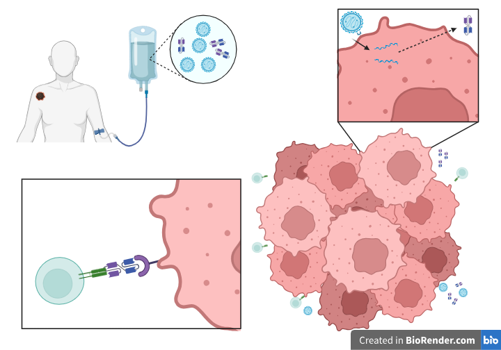

The code in this repository accompanies the manuscript **"In silico clinical trials of BiTE expression by oncolytic viruses reveal the impact of patient heterogeneity on dosage protocol"** Jenner et al. submitted to PLOS Computational Biology

In this paper, we develop a system of ordinary differential equations (ODEs) to describe the interaction between tumour cells, T cells and an oncolytic virus expressing bi-specific T cells engagers (BiTEs). All code developed for the manuscript was in MATLAB. 

To simulate the ODE model in the manuscript, see "ODE model - MATLAB" folder. To simulate the model, run "commands.m". This code was run in MATLAB 2023b and MATLAB 2024b.

For reproducibility, we have also provided the code to simulate the ODE model in Julia, see "ODE model - Julia".

Included in this repositiory, is the fitting code to fit the in vitro cell viability and viral projeny measurements to the submodel, all presented in the supplementary information of the paper. To run the fitting code, run "commands_cellviab_viralproj.m".

We have also included some example code for the sensistivity analysis we conducted in the paper. This includes a local sensitivity analysis and Latin Hypercube sampling of the parameters, as well as changes to the dosage protocol. 

Below is Figure 1 from our paper. It summarises the biology behind the model, i.e. that a virus is injected intravenously and once at the tumour site, infects and kills tumour cells whilst also recruiting the immune system. 

